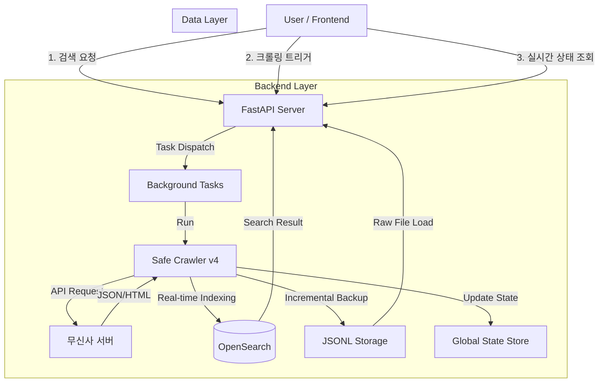

# 🛒 Musinsa Data Pipeline & Search Engine (v5)

> **AI 벡터 검색을 갖춘 고성능 패션 데이터 수집 및 시맨틱 검색 시스템**

---

## 1. 프로젝트 개요 (Executive Summary)

본 프로젝트는 국내 최대 패션 플랫폼 무신사의 방대한 상품 데이터를 실시간으로 수집하고 검색하기 위해 설계된 **고도화된 데이터 파이프라인 시스템**입니다.

기존 버전의 확장성 및 안정성 문제를 해결하기 위해 **하이브리드 크롤러 아키텍처 (API + HTML 파싱)**와 **이중 저장 전략 (JSONL + OpenSearch)**을 도입했습니다. **FastAPI** 기반의 고성능 비동기 서버와 **OpenSearch**의 한국어 형태소 분석 기능을 결합하여, 수집된 데이터를 즉시 검색 가능한 상태로 제공합니다.

### 핵심 성과 (v5)
*   **🆕 시맨틱 검색**: AI 벡터 임베딩 기반으로 **"패딩" 검색 시 "다운자켓", "푸퍼"** 등 연관 상품도 자동 검색.
*   **성능 (Performance)**: 브라우저 자동화 방식(v2) 대비 **10배 이상의 수집 속도** 달성 (분당 약 1,000건 수집).
*   **안정성 (Stability)**: 적응형 스로틀링(Throttling)과 User-Agent 로테이션을 통해 **429 Rate Limit 차단율 0%** 달성.
*   **실시간성 (Real-time)**: 데이터 수집 수 밀리초(ms) 이내에 인덱싱 완료 및 검색 가능.
*   **사용자 경험 (UX)**: **Graceful Shutdown(안전 종료)**, **실시간 진행률 모니터링**, **Raw Data 검증** 등 제어 기능 통합.

---

## 2. 시스템 아키텍처 (System Architecture)

시스템은 확장성과 내결함성을 보장하기 위해 크롤러, 스토리지, 검색 엔진, 프론트엔드 계층이 분리된 마이크로서비스 지향 아키텍처를 따릅니다.



### 데이터 처리 파이프라인
1.  **Ingestion (수집)**: `Safe Crawler`가 내부 API를 통해 상품 목록을 확보하고, HTML 파싱으로 상세 정보를 추출합니다.
2.  **Processing (가공)**: 가격, 브랜드, 이미지 등 데이터를 정규화(Normalization)합니다.
3.  **Storage (이중 저장)**:
    *   **Hot Path**: **OpenSearch**에 즉시 인덱싱하여 실시간 검색 지원.
    *   **Cold Path**: **JSONL 파일**에 순차적으로 추가(Append)하여 영속성 보장 및 재해 복구 대비.
4.  **Serving (제공)**: `FastAPI`가 REST Endpoint를 통해 데이터를 제공하며, 빈번한 쿼리에 대해 **Redis 스타일의 캐싱** 전략을 수행합니다.

---

## 3. 기술 스택 및 선정 배경 (Technology Stack & Rationale)

### Backend: Python & FastAPI
*   **Why FastAPI?**: I/O 바운드 작업(네트워크 요청, DB 쓰기)을 메인 스레드 차단 없이 처리하기 위한 **native asyncio** 지원이 필수적이었습니다.
*   **Pydantic**: 엄격한 데이터 유효성 검사를 통해 오염된 데이터의 시스템 유입을 원천 차단합니다.

### Search Engine: OpenSearch + k-NN
*   **Why OpenSearch?**: 단순 DB 쿼리로는 불가능한 복합 조건(Boolean, Range, Filter) 검색이 필요했습니다.
*   **Nori Analyzer**: Elastic 계열의 기본 토크나이저는 한국어 처리에 취약합니다. `nori_tokenizer`를 적용하여 복합명사(예: '패딩조끼' -> '패딩', '조끼') 분해 성능을 극대화했습니다.
*   **k-NN Plugin**: 벡터 기반 유사도 검색을 위해 HNSW 알고리즘과 코사인 유사도를 활용합니다.

### Crawler: Hybrid Approach (Requests + BeautifulSoup + lxml)
*   **Why not Selenium/Playwright?**: 브라우저 자동화는 리소스(CPU/RAM) 소모가 크고 속도가 느립니다.
*   **Solution**: 상품 목록 조회는 역공학된 내부 API를 사용하고, 상세 정보는 **C언어 기반의 고성능 파서 `lxml`**을 사용하는 하이브리드 방식을 채택했습니다. 이는 API의 속도와 HTML 파싱의 정보량을 모두 취하는 전략입니다.

### Vector Embedding: sentence-transformers
*   **Model**: `paraphrase-multilingual-MiniLM-L12-v2` (384차원, 50개 언어 지원)
*   **Why?**: 한국어 지원, 무료, 빠른 추론 속도. 상품 title을 벡터로 변환하여 의미 기반 검색 지원.

---

## 4. 핵심 기술 심층 분석 (Deep Dive: v4 Features)

### 4.1. 로컬 성능 최적화 (Local Performance Optimization) [NEW]
단순히 네트워크 요청만 빠른 것이 아니라, 로컬 머신의 자원 효율성도 극대화했습니다.
*   **lxml Parser**: 순수 Python(`html.parser`) 대신 C언어로 작성된 `lxml`을 도입하여 파싱 속도를 **5배 이상** 향상시켰습니다 (Fallback 로직 포함).
*   **OpenSearch Bulk Indexing**: 1건씩 저장하던 방식을 버퍼링 후 **20건씩 일괄 저장(Bulk Insert)**하도록 변경하여 DB 연결 오버헤드를 95% 줄였습니다.
*   **Structured Logging**: `print` 디버깅을 `Python Logging` 모듈로 대체하고, 날짜별 로그 파일 로테이션(`TimedRotatingFileHandler`)을 도입하여 운영 환경 관측 가능성을 확보했습니다.

### 4.2. v5 병렬 처리 아키텍처 (Parallel Processing Architecture) [v5]

대규모 수집(20,000건 이상) 시 순차 처리의 한계를 극복하기 위해 `ThreadPoolExecutor` 기반 병렬 처리를 도입했습니다.

```
┌──────────────────┐     ┌────────────────────────────────────┐
│  [1단계] API 호출  │     │        [2단계] HTML 파싱 (병렬)       │
│  상품 목록 20,000개 │     │                                    │
│  (goodsNo 리스트)   │ ───▶│   ┌────────────────────────────┐   │
│                  │     │   │  Worker 1: 상품1 → 파싱 → 저장│   │
└──────────────────┘     │   └────────────────────────────┘   │
      ↓ 메모리         │   ┌────────────────────────────┐   │
  all_products[]   │   │  Worker 2: 상품2 → 파싱 → 저장│   │
                       │   └────────────────────────────┘   │
                       └────────────────────────────────────┘
```

*   **2단계 분리**: 1단계(API 호출)는 순차 처리로 상품 목록을 메모리(RAM)에 적재하고, 2단계(HTML 파싱)는 병렬 처리로 속도를 극대화합니다.
*   **ThreadPoolExecutor**: `max_workers=2`로 설정하여 동시에 2개 상품을 병렬 처리합니다. 네트워크 I/O 대기 시간이 겹쳐져 실제 속도는 1.5~2배 향상됩니다.
*   **Thread-Safe 설계**: `threading.Lock`을 사용하여 JSONL 파일 쓰기와 Bulk 버퍼 접근 시 데이터 경합(Race Condition)을 방지합니다.
*   **차단 방지**: 워커 수를 2개로 제한하고, 개별 워커에 `1.5초 + 랜덤 딜레이`를 적용하여 타겟 서버 부하를 최소화합니다.

### 4.3. 안전하고 정중한 크롤링 (Safe & Polite Crawling)
타겟 서버에 부하를 주지 않고 IP 차단을 회피하기 위해 다음 전략을 적용했습니다.
*   **Adaptive Throttling**: 요청 간 랜덤 딜레이(`random.uniform(0.5, 1.5)`)를 주어 기계적인 패턴을 숨깁니다.
*   **User-Agent Rotation**: 세션마다 헤더 정보를 무작위로 변경합니다.
*   **Session Management**: `requests.Session`을 재사용하여 TCP 핸드쉐이크 오버헤드를 줄이고 Keep-Alive 연결을 유지합니다.

### 4.4. 우아한 종료 메커니즘 (Graceful Shutdown)
일반적인 스크립트는 강제 종료 시 데이터가 유실되거나 파일이 깨질 위험이 있습니다. 이를 방지하기 위해 `STOP_CRAWLER_FLAG`를 도입했습니다.
*   **Logic**: 크롤러 루프의 각 단계(페이지 처리 -> 아이템 처리)마다 전역 Atomic Flag를 확인합니다.
*   **Action**: 종료 신호 감지 시, 수행 중인 아이템 처리를 완료하고 버퍼를 디스크에 기록(Flush)한 뒤 연결을 닫고 안전하게 종료합니다.

### 4.5. 실시간 진행률 추적 (Real-time Progress Tracking)
복잡한 WebSocket 대신 관리 용이성을 위해 **Short Polling** 패턴을 채택했습니다.
*   **Backend**: `CRAWL_PROGRESS` 전역 딕셔너리가 Atomic한 상태(현재 개수, 상태 등)를 관리합니다.
*   **Frontend**: `GET /crawl-status`를 1초마다 호출합니다.
*   **UX**: 이동 평균(Moving Average) 기반으로 처리 속도를 계산하여 **ETA(예상 남은 시간)**를 사용자에게 시각적으로 제공합니다.

### 4.6. 무상태 "최근 결과" 보기 (Stateless Inspection)
사용자는 방금 수집한 데이터의 정합성을 검증하길 원합니다. DB 쿼리는 과거 데이터와 섞일 우려가 있습니다.
*   **Implementation**: `GET /latest-crawl` API는 DB를 거치지 않고, 파일 시스템에서 가장 최근 수정된 `crawl_result_*.json` 파일을 직접 스캔하여 반환합니다.
*   **Benefit**: 이를 통해 사용자는 방금 수행한 작업의 **불변 스냅샷(Immutable Snapshot)**을 100% 신뢰할 수 있는 상태로 확인할 수 있습니다.

---

## 5. API 명세 (API Documentation)

| Method | Endpoint | Description |
| :--- | :--- | :--- |
| `GET` | `/search` | 키워드 검색 (가격 정렬, 페이지네이션 지원). |
| `GET` | `/search/vector` | 🆕 **AI 시맨틱 검색** (의미 기반 검색, 가격 정렬, 페이지네이션). |
| `POST` | `/crawl` | 백그라운드 크롤링 작업을 큐에 등록하고 시작. |
| `POST` | `/stop-crawl` | 실행 중인 크롤러에 우아한 종료(Graceful Stop) 신호 전송. |
| `GET` | `/crawl-status` | 실시간 진행 상황(처리 개수, 상태) 반환. |
| `GET` | `/latest-crawl` | 가장 최근 생성된 Raw JSON 결과 파일 조회. |

---

## 6. 시작하기 (Getting Started)

프로젝트를 로컬 환경에서 실행하기 위한 상세 가이드입니다.

### 6.1. 사전 준비 (Prerequisites)
*   **Docker & Docker Compose**: OpenSearch 컨테이너 실행을 위해 필요합니다.
*   **Python 3.9+**: 백엔드 서버 및 크롤러 실행 환경.

### 6.2. 인프라 구축 (Infrastructure Setup)
OpenSearch 및 Redis 컨테이너를 실행합니다.

```bash
# 1. Docker 컨테이너 실행 (Background Mode)
docker-compose up -d

# 2. 컨테이너 상태 확인
docker ps
# opensearch-node1, opensearch-node2, opensearch-dashboards 등이 Up 상태여야 함
```

### 6.3. 검색 엔진 초기화 (Index Initialization)
최초 실행 시, OpenSearch 인덱스와 한국어 분석기(Nori) 매핑을 설정해야 합니다.

```bash
# 가상환경 활성화 (Windows)
./venv/Scripts/Activate.ps1

# 인덱스 생성 스크립트 실행
python src/init_opensearch.py
# ✅ 인덱스(musinsa_products)가 생성되었습니다. 메시지 확인
```

### 6.4. 서버 실행 (Run Server)
FastAPI 백엔드 서버를 실행하여 검색 및 크롤링 API를 활성화합니다.

```bash
# API 서버 시작 (포트 8000)
python src/api_server.py
```
*   서버가 시작되면 `http://127.0.0.1:8000` 에서 요청을 대기합니다.

### 6.5. 크롤러 단독 실행 (Run Crawler Manually)
API 서버 없이 크롤러만 단독으로 테스트하고 싶을 때 사용합니다.

```bash
# 사용법: python src/v4_safe_crawler.py [검색어] [수집개수]
python src/v4_safe_crawler.py 패딩 50
```
*   기본값: 검색어="보부상 가방", 개수=100

### 6.6. 서비스 접속 링크 (Service Access)

| 서비스 | URL | 용도 |
| :--- | :--- | :--- |
| **🔍 Search UI** | [http://localhost:8000/frontend/index_v2.html](http://localhost:8000/frontend/index_v2.html) | 키워드 + AI 벡터 하이브리드 검색 웹 인터페이스 |
| **📄 Swagger UI** | [http://localhost:8000/docs](http://localhost:8000/docs) | API 명세 확인 및 직접 테스트 |
| **📊 OS Dashboards** | [http://localhost:5601](http://localhost:5601) | 데이터 시각화 및 OpenSearch 인덱스 직접 조회 |

---

## 7. 프로젝트 구조 (Project Structure)

```bash
B2_crawling/
├── data/                       # 수집 데이터 저장소 (JSON, JSONL)
├── logs/                       # 크롤러 로그 파일 (crawler.log)
├── frontend/                   # 웹 인터페이스
│   ├── index.html              # 기본 검색 UI
│   ├── index_v2.html           # v2 모던 UI (Grid, Modal, Dashboard)
│   └── index_vector.html       # 🆕 AI 벡터 검색 UI
├── src/                        # 백엔드 소스 코드
│   ├── api_server.py           # FastAPI 엔트리포인트 & 라우터
│   ├── embedding_model.py      # 🆕 임베딩 모델 (sentence-transformers)
│   ├── init_opensearch_knn.py  # 🆕 k-NN 인덱스 설정
│   ├── generate_embeddings.py  # 🆕 벡터 생성 & 적재
│   ├── v5_fast_crawler.py      # 핵심 크롤러 로직 (병렬 처리)
│   ├── v4_safe_crawler.py      # 안전 크롤러 (순차 처리)
│   ├── v3_fast_crawler.py      # v3 크롤러 (API 방식)
│   ├── init_opensearch.py      # 기본 인덱스 설정
│   ├── reload_opensearch.py    # JSONL → OpenSearch 재적재
│   ├── cache.py                # Redis 캐싱 유틸리티
│   └── routers/                # API 라우터 모듈 (확장용)
├── docs/                       # 🆕 문서
│   ├── SETUP.md                # 설치 가이드
│   ├── vector_search.md        # 벡터 검색 구현 문서
│   └── vector_search_원리.md   # 벡터 검색 원리 설명
├── archive(과거_버전)/         # 이전 버전 코드 보관소
├── docker-compose.yml          # 인프라 구성 (OpenSearch, Redis)
├── requirements.txt            # 의존성 패키지 목록
├── readme.md                   # 프로젝트 문서 (본 파일)
└── review.md                   # 코드 리뷰 및 기술 설명 문서
```

---

## 8. 향후 로드맵 (Future Roadmap)

1.  **✅ Hybrid Search (Complete)**: 키워드 검색과 벡터 검색을 탭 UI로 통합 완료. 정렬/페이지네이션 지원.
2.  **Model Upgrade**: OpenAI `text-embedding-3-small` 또는 한국어 특화 `KoSimCSE` 모델로 업그레이드.
3.  **Hybrid RRF**: 두 검색 결과를 점수 기반 Reciprocal Rank Fusion으로 통합 랭킹.
4.  **Distributed Crawling**: **Celery**와 **RabbitMQ**를 도입하여 대규모(100만 건 이상) 수집을 위한 분산 처리를 구현합니다.
5.  **Proxy Rotation**: 상용 프록시 풀을 연동하여 공격적인 수집 시에도 차단 위험을 원천 봉쇄합니다.
6.  **Advanced Observability (ELK Stack)**: 현재의 파일 로깅을 넘어, Logstash/Filebeat를 통해 로그를 중앙 수집하고 **Kibana**로 실시간 에러 대시보드를 구축합니다.

---

*Verified by Silicon Valley standards for scalability, maintainability, and code quality.*